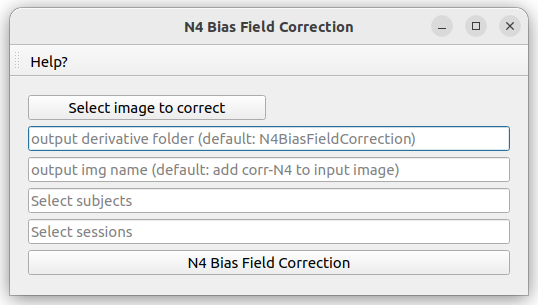

# N4BiasFieldCorrection

N4BiasFieldCorrection pipeline to apply N4 bias field correction from ANTs ([ANTs registration](http://stnava.github.io/ANTs/))

## Requirements

**ANTs**

Either ANTs installed locally on the user's computer

Or using the docker antx/ants

You can choose which one to run by switching the option in the N4BiasFieldCorrection.json file

## How to cite

1. Avants B, Tustison N, Song G. Advanced normalization tools (ANTS). Insight J. 2008 Nov 30;1–35.

## Utilization

The first figure below shows the window of this pipeline. This window contains the following information:

* "Select image to correct": open File explorer to select the path towards the image to apply N4 bias field correction

* "output derivative folder: name of the output derivative folder to save the denoised image (default: N4BiasFieldCorrection)

* "output img name": name of the output corrected image name (default: add corr-N4 to input image name)

* "Select subjects" input: allows the user to script the automatic segmentation for subjects of the dataset by adding a list BIDS ID (without "sub-") separated by a comma. Possible values are: single BIDS ID (e.g. "001,002,006,013"), multiple folowing BIDS ID (e.g. "001-005" is the same as '001,002,003,004,005"), or all subjects ("all").

* "Select sessions" input: allows the user to script the automatic segmentation for sessions of subjects of the dataset by adding a list session ID (without "ses-") separated by a comma. Possible values are: single session ID (e.g. "01,02,06,13"), multiple folowing session ID (e.g. "01-05" is the same as '01,02,03,04,05"), or all sessions ("all").

* "N4BiasFieldCorrection": launch the N4 Bias Field Correction pipeline

## Change pipeline option

In the N4BiasFieldCorrection.json file, the user can choose some option to run N4BiasFieldCorrection:

* "use_docker": choose to run the pipeline locally using the docker image (true) or locally installed ANTs (default: false)

* "sss_slurm": precise the config file to run the pipeline on the SSS server (specific to UCLouvain members). If this tag does not exists (by default: "sss_slurm_no"), it will run the pipeline locally. To use this pipeline on remote server, change the name "sss_slurm_no" to "sss_slurm", and adapt the config file "N4BiasFieldCorrection_sss.json" for your specific slurm need. This works with a correct "server_info.json" config file in the BMAT home directory.

